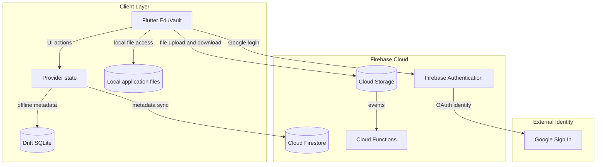
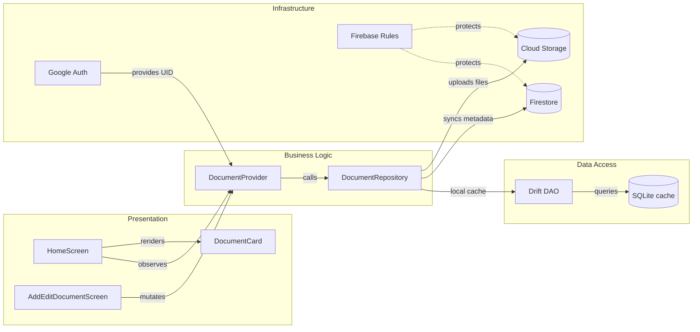

# Architecture Diagram

Tai lieu nay tom tat kien truc hien tai cua EduVault va kien truc dich de xuat khi
tich hop Firebase. Ung dung hien tai la Flutter offline-first, chua co backend
tap trung; cac dich vu Firebase trong so do la thanh phan de xuat.

## Application Architecture

<!-- mermaid-checked: no \n, no em-dash/en-dash, no {} in labels, subgraphs are id["label"], arrows are -->|"label"|, all subgraphs closed by end, ids unique -->

### Technology Stack Summary

| Layer | Technology | Version | Purpose |
|---|---|---|---|
| UI | Flutter Material 3 | SDK 3.13.4 | Cross-platform client |
| State | Provider and ChangeNotifier | 6.1.5+1 | Presentation state and reactive updates |
| Domain | Dart models and repository interface | Dart 3.13.4 | Isolate business models from persistence |
| Local data | Drift ORM and SQLite | Drift 2.35.1 | Offline metadata cache |
| Local files | `file_picker`, `path_provider` | Current pubspec | Select and copy files to app storage |
| Cloud auth | Firebase Authentication and Google | Proposed | Identity and sessions |
| Cloud database | Cloud Firestore | Proposed | Shared document metadata |
| Cloud files | Cloud Storage for Firebase | Proposed | Durable object storage |
| Automation | Cloud Functions | Optional | Post-upload and cleanup jobs |

### Data Storage & External Services

Hien tai SQLite va file system tren thiet bi la storage chinh. Kien truc dich chuyen
metadata dung Firestore va noi dung tep dung Cloud Storage; Drift va local files
duoc giu lam cache offline. Firebase Authentication cung cap UID de Rules gioi han
du lieu theo nguoi dung.

### Key Architectural Decisions

- Giu repository abstraction de thay doi backend ma khong buoc UI phu thuoc Firebase.
- Dung `ownerId` trong moi document va duong dan Storage co pham vi theo UID.
- Dong bo theo mo hinh offline-first, co retry va trang thai pending thay vi thanh
  cong gia khi upload chua hoan tat.

## Component Relationships

<!-- mermaid-checked: no \n, no em-dash/en-dash, no {} in labels, subgraphs are id["label"], arrows are -->|"label"|, all subgraphs closed by end, ids unique -->

### Component Inventory

| Component | Layer | Type | Responsibility |
|---|---|---|---|
| `HomeScreen` | Presentation | Flutter screen | List, search, filter, open and delete documents |
| `AddEditDocumentScreen` | Presentation | Flutter screen | Validate metadata and select/copy files |
| `DocumentCard` | Presentation | Widget | Render title, subject, category and attachment |
| `DocumentProvider` | Business Logic | ChangeNotifier | Manage state and repository subscriptions |
| `DocumentRepository` | Business Logic | Interface | Abstract local and cloud persistence |
| `Drift DAO` | Data Access | DAO | Query and mutate local SQLite |
| `SQLite cache` | Data Access | Local database | Offline metadata and reactive streams |
| `Google Auth` | Infrastructure | Firebase service | Google sign-in and Firebase session |
| `Firestore` | Infrastructure | Cloud database | Shared metadata and sync source |
| `Cloud Storage` | Infrastructure | Object storage | Durable document files |
| `Firebase Rules` | Infrastructure | Policy | Enforce owner-based access |
