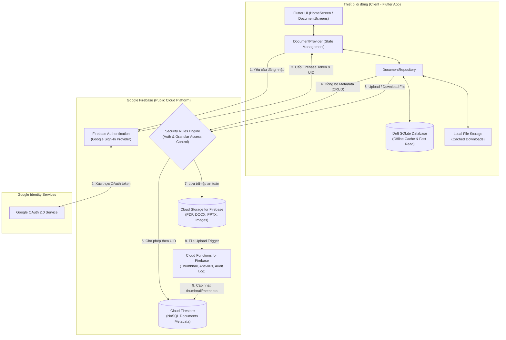

# BÁO CÁO PHÂN TÍCH VÀ ĐỀ XUẤT KIẾN TRÚC TÍCH HỢP CLOUD CHO HỆ THỐNG QUẢN LÝ TÀI LIỆU (EDUVAULT)

---

## 1. Liệt kê và Phân tích các thành phần cốt lõi của ứng dụng Quản lý tài liệu (EduVault)

Hiện trạng ứng dụng **EduVault** được xây dựng dưới dạng ứng dụng di động cục bộ (local-first/standalone client) bằng Flutter. Dưới đây là phân tích chi tiết 4 thành phần cốt lõi:

| Thành phần | Hiện trạng trong EduVault | Công nghệ sử dụng | Chức năng & Vai trò |
| :--- | :--- | :--- | :--- |
| **1. Frontend (Giao diện người dùng)** | Mobile Client (Android, iOS, Web/Desktop) | Flutter SDK, Material 3, `Provider` (`ChangeNotifier`) | - Cung cấp giao diện duyệt, tìm kiếm, lọc tài liệu theo danh mục, môn học, mức ưu tiên, tags.<br>- Điều phối trạng thái hiển thị (state management), tiếp nhận thao tác thêm/sửa/xóa và mở file tài liệu qua `open_filex` / `url_launcher`. |
| **2. Backend (Lớp xử lý nghiệp vụ)** | **Chưa có Backend tập trung** (Embedded Business Logic) | Logic nhúng trực tiếp trong `DocumentProvider` và `DocumentRepository` | - Xử lý nghiệp vụ tại chỗ trên client: validate form, gắn UUID, lọc danh mục, định dạng ngày tháng.<br>- **Thiếu sót:** Chưa có API Gateway, không có cơ chế xác thực tập trung (Authentication Server), không có phân quyền (Authorization) hay xử lý bất đồng bộ phía máy chủ. |
| **3. Database (Cơ sở dữ liệu)** | Cơ sở dữ liệu nhúng (Embedded Relational DB) | **Drift ORM** trên nền tảng **SQLite** | - Lưu trữ metadata: bảng `DocumentsTable` (tiêu đề, môn học, mô tả, đường dẫn file, tags, ngày tạo, cập nhật) và `CategoriesTable`.<br>- Cung cấp phản ứng dữ liệu thời gian thực (Reactive Streams via SQLite) cho UI cục bộ. |
| **4. File Storage (Lưu trữ tệp)** | Bộ nhớ cục bộ thiết bị (Local Device Storage) | `file_picker`, `path_provider` (`ApplicationDocumentsDirectory`) | - Sao chép tệp từ bộ nhớ người dùng vào thư mục nội bộ `EduVault/Documents/`.<br>- Cơ sở dữ liệu SQLite chỉ lưu đường dẫn tệp tuyệt đối/tương đối (`filePathOrUrl`). |

---

## 2. Xác định các điểm nghẽn và hạn chế của hệ thống trên hạ tầng truyền thống

Khi vận hành trên hạ tầng truyền thống (on-premise server tự quản lý hoặc mô hình máy trạm/thiết bị cục bộ đơn lẻ), hệ thống gặp phải các rào cản nghiêm trọng:

1. **Rủi ro mất mát dữ liệu (Data Loss) & Không có Disaster Recovery:**
   - Dữ liệu và tệp tin bị "khóa cứng" (isolated silo) trên từng thiết bị người dùng. Khi thiết bị hỏng, mất cắp hoặc gỡ cài đặt, toàn bộ tài liệu học tập bị biến mất vĩnh viễn mà không có cơ chế backup/restore tự động.
2. **Không hỗ trợ đồng bộ đa thiết bị (Cross-device Synchronization):**
   - Sinh viên không thể truy cập tài liệu đã lưu trên điện thoại khi chuyển sang máy tính bảng hoặc laptop do thiếu cơ chế đồng bộ dữ liệu tập trung.
3. **Thiếu hệ thống định danh và phân quyền tập trung (Identity & Access Control):**
   - Không có tài khoản người dùng, không thể chia sẻ tài liệu giữa các thành viên, không thể bảo vệ quyền riêng tư nếu nhiều người cùng truy cập một thiết bị.
4. **Điểm nghẽn dung lượng lưu trữ (Storage Scalability Bottleneck):**
   - Trên thiết bị cục bộ: Bị giới hạn bởi bộ nhớ khả dụng của điện thoại.
   - Nếu dựng máy chủ File Server truyền thống (FTP/NAS/Local SAN): Chi phí đầu tư đĩa cứng lớn, khó mở rộng linh hoạt theo nhu cầu (Vertical scaling tốn kém), nguy cơ hỏng ổ cứng vật lý.
5. **Điểm nghẽn băng thông và hiệu năng I/O khi mở rộng:**
   - Máy chủ truyền thống dễ bị nghẽn mạng (Network Saturation) khi có nhiều người cùng tải tài liệu dung lượng lớn (PDF bài giảng, video ghi hình) cùng một thời điểm.
6. **Chi phí vận hành và bảo trì (High OpEx & CapEx):**
   - Vận hành máy chủ vật lý đòi hỏi nhân sự túc trực để bảo trì phần cứng, cấu hình firewall, thiết lập SSL/TLS, cập nhật bản vá bảo mật và sao lưu định kỳ.

---

## 3. Lựa chọn mô hình triển khai Cloud và Dịch vụ cụ thể

### 3.1. So sánh các mô hình triển khai Cloud

| Tiêu chí | Public Cloud (Đám mây công cộng) | Private Cloud (Đám mây riêng) | Hybrid Cloud (Đám mây lai) |
| :--- | :--- | :--- | :--- |
| **Đặc điểm** | Hạ tầng thuộc sở hữu của nhà cung cấp dịch vụ lớn (Google, AWS, Microsoft), dùng chung tài nguyên đa người thuê (Multi-tenant). | Hạ tầng dành riêng cho một tổ chức duy nhất, đặt tại on-premise data center hoặc thuê riêng. | Kết hợp giữa Public Cloud và Private Cloud, dữ liệu trao đổi qua VPN/Direct Connect. |
| **Chi phí** | **Pay-as-you-go** (dùng bao nhiêu trả bấy nhiêu), không tốn vốn đầu tư ban đầu (Zero CapEx), có gói miễn phí (Free Tier). | Chi phí phần cứng và nhân sự cực kỳ đắt đỏ (CapEx & OpEx cao). | Chi phí tích hợp, bảo trì kết nối và hạ tầng phức tạp. |
| **Khả năng mở rộng** | Co giãn tự động, gần như không giới hạn (Auto-scaling). | Bị giới hạn bởi năng lực phần cứng đã mua sắm. | Linh hoạt nhưng phụ thuộc vào băng thông đường truyền kết nối giữa 2 vùng. |
| **Bảo trì & Vận hành** | Nhà cung cấp đảm bảo uptime (99.99%), tự động vá lỗi bảo mật. | Tự chịu trách nhiệm toàn bộ rủi ro phần cứng và hệ thống. | Yêu cầu đội ngũ kỹ sư hạ tầng chuyên sâu. |
| **Đánh giá lựa chọn** | **LỰA CHỌN TỐI ƯU:** Phù hợp hoàn hảo cho ứng dụng di động EduVault, triển khai thần tốc, chi phí 0đ ở giai đoạn đầu, SDK di động hoàn thiện. | Không phù hợp do lãng phí tài nguyên và chi phí vượt quá ngân sách. | Chưa cần thiết ở giai đoạn hiện tại (chỉ cân nhắc nếu nhà trường bắt buộc lưu trữ dữ liệu nhạy cảm on-premise). |

### 3.2. Đánh giá và Lựa chọn dịch vụ Object Storage

| Dịch vụ | Ưu điểm | Nhược điểm | Đánh giá với EduVault |
| :--- | :--- | :--- | :--- |
| **Firebase Cloud Storage** *(Lựa chọn chính)* | - Tích hợp chặt chẽ với **Firebase Authentication** và **Storage Security Rules**.<br>- SDK Flutter chính thức (`firebase_storage`) hỗ trợ upload resumable, download stream, offline retry.<br>- Sử dụng hạ tầng Google Cloud Storage bên dưới. | Chi phí tính trên dung lượng lưu trữ và băng thông egress (cần kiểm soát quota). | **Lựa chọn hàng đầu:** Tối ưu tốc độ phát triển cho Flutter, không cần viết backend trung gian để cấp quyền file. |
| **Google Cloud Storage (GCS)** | Hạ tầng gốc mạnh mẽ, quản lý bucket và IAM chi tiết. | Khó cấu hình phân quyền trực tiếp từ mobile app nếu không qua backend API. | Dùng qua lớp bọc Firebase Storage. |
| **AWS S3** | Hệ sinh thái hoàn chỉnh nhất, phân tầng lưu trữ (Glacier) tối ưu chi phí lưu trữ lâu dài. | Cần cấu hình AWS Cognito hoặc viết server tạo Presigned URLs, tăng độ phức tạp cho ứng dụng Flutter. | Phù hợp nếu toàn bộ hạ tầng đã nằm trên AWS. |
| **Azure Blob Storage** | Quản lý định danh qua Azure AD tốt, mạnh về tích hợp doanh nghiệp Microsoft. | SDK Flutter cộng đồng không tối ưu bằng Firebase, cấu hình xác thực phức tạp cho mobile client. | Phù hợp cho môi trường Enterprise Windows/Office 365. |

---

## 4. Thiết kế Kiến trúc tích hợp Cloud và Luồng dữ liệu

### 4.1. Sơ đồ kiến trúc tổng thể (Architecture Diagram)

Ứng dụng kết hợp mô hình **Client-to-Cloud trực tiếp an toàn** (Serverless BaaS) với bộ đệm **Drift SQLite Cache** trên thiết bị để đảm bảo trải nghiệm Offline-First:



---

### 4.2. Luồng dữ liệu chi tiết (Data Flow)

#### A. Luồng Đăng nhập với Google (Google Authentication Flow)
1. Người dùng nhấn nút **"Đăng nhập với Google"** trên màn hình Flutter.
2. Ứng dụng gọi `google_sign_in` để kích hoạt giao diện đăng nhập Google OAuth 2.0.
3. Người dùng cấp quyền, Google trả về `GoogleSignInAuthentication` (gồm `idToken` và `accessToken`).
4. Ứng dụng chuyển đổi credential và gọi `FirebaseAuth.instance.signInWithCredential()`.
5. Firebase Authentication xác minh token, tạo phiên đăng nhập người dùng và trả về một `User` với định danh duy nhất (`UID`).
6. Ứng dụng khởi tạo hồ sơ người dùng trong Firestore nếu là lần đăng nhập đầu tiên và dùng `UID` để cách ly toàn bộ dữ liệu.

#### B. Luồng Tải lên (Upload) và Đồng bộ Tài liệu
1. Người dùng chọn tệp từ máy (thông qua `file_picker`) và nhập thông tin (tiêu đề, môn học, tags).
2. Client kiểm tra kích thước (< 50MB) và định dạng tệp hợp lệ (PDF, DOCX, XLSX, hình ảnh).
3. `DocumentRepository` tải tệp trực tiếp lên Firebase Storage theo đường dẫn an toàn:
   ```text
   users/{uid}/documents/{documentId}/{fileName}
   ```
4. Sau khi upload thành công, Storage trả về metadata và đường dẫn `storagePath` (hoặc Download URL bảo mật).
5. Repository tạo đối tượng Metadata và ghi vào **Cloud Firestore**:
   - `id`: UUID của tài liệu
   - `ownerId`: `UID` của người dùng
   - `title`, `subject`, `tags`, `priority`
   - `storagePath`: Đường dẫn tệp trên Firebase Storage
   - `fileSize`, `mimeType`, `createdAt`, `updatedAt`
6. Firestore đồng bộ dữ liệu về **Drift SQLite Cache** trên thiết bị; giao diện cập nhật ngay lập tức thông qua Stream.

#### C. Luồng Đọc và Truy cập Ngoại tuyến (Offline-First Read Flow)
1. Khi mở ứng dụng, màn hình truy vấn dữ liệu từ **Drift SQLite Cache** để hiển thị ngay lập tức không có độ trễ.
2. Ứng dụng lắng nghe `onSnapshot` từ Cloud Firestore để cập nhật các thay đổi mới nhất từ Cloud vào SQLite.
3. Khi người dùng muốn xem tệp:
   - Nếu tệp đã có trong thư mục tạm cục bộ (`localPath` còn tồn tại) $\rightarrow$ Mở ngay qua `open_filex`.
   - Nếu chưa có $\rightarrow$ Tải tệp từ Firebase Storage về máy, lưu cache và mở tệp.
4. Nếu mất kết nối Internet: Người dùng vẫn có thể xem danh sách tài liệu và đọc các tệp đã được tải trước đó. Thao tác ghi mới sẽ được đưa vào hàng đợi (Sync Queue) để đẩy lên Cloud khi có mạng trở lại.

---

## 5. Hướng dẫn tích hợp Firebase Authentication & Storage vào Flutter

Theo tài liệu chính thức của Google ([Firebase Flutter Setup](https://firebase.google.com/docs/flutter/setup?hl=vi)):

### Bước 1: Cài đặt công cụ và liên kết dự án
```bash
# 1. Cài đặt Firebase CLI (nếu chưa có) và đăng nhập
npm install -g firebase-tools
firebase login

# 2. Cài đặt FlutterFire CLI toàn cục
dart pub global activate flutterfire_cli

# 3. Chạy cấu hình tự động cho project Flutter
flutterfire configure
```
*Lệnh trên sẽ tự động tạo file `lib/firebase_options.dart` chứa thông số cấu hình chính xác cho Android, iOS, Web.*

### Bước 2: Thêm các thư viện cần thiết vào `pubspec.yaml`
```bash
flutter pub add firebase_core
flutter pub add firebase_auth
flutter pub add google_sign_in
flutter pub add cloud_firestore
flutter pub add firebase_storage
```

### Bước 3: Khởi tạo Firebase tại `lib/main.dart`
```dart
import 'package:flutter/material.dart';
import 'package:firebase_core/firebase_core.dart';
import 'firebase_options.dart';

void main() async {
  WidgetsFlutterBinding.ensureInitialized();
  await Firebase.initializeApp(
    options: DefaultFirebaseOptions.currentPlatform,
  );
  runApp(const EduVaultApp());
}
```

### Bước 4: Thiết lập Security Rules bảo vệ dữ liệu

#### Cloud Firestore Security Rules (`firestore.rules`):
```javascript
rules_version = '2';
service cloud.firestore {
  match /databases/{database}/documents {
    // Chỉ người dùng đã đăng nhập mới có quyền truy cập dữ liệu của chính mình
    match /users/{userId}/documents/{documentId} {
      allow read, write: if request.auth != null && request.auth.uid == userId;
    }
  }
}
```

#### Cloud Storage Security Rules (`storage.rules`):
```javascript
rules_version = '2';
service firebase.storage {
  match /b/{bucket}/o {
    match /users/{userId}/documents/{documentId}/{fileName} {
      // Xác thực UID và giới hạn kích thước file <= 50MB
      allow read, write: if request.auth != null 
                         && request.auth.uid == userId
                         && request.resource.size < 50 * 1024 * 1024;
    }
  }
}
```

---

## 6. Đánh giá Tác động sau khi tích hợp Cloud

### 6.1. Về Bảo mật (Security)
* **Xác thực an toàn:** Sử dụng tiêu chuẩn công nghiệp Google OAuth 2.0; ứng dụng không bao giờ lưu trữ mật khẩu người dùng dạng clear text.
* **Mã hóa toàn diện:**
  * *Data in Transit:* Toàn bộ dữ liệu trao đổi giữa Flutter và Cloud được mã hóa qua TLS 1.3/HTTPS.
  * *Data at Rest:* Dữ liệu trên Firestore và Storage được Google mã hóa mặc định theo chuẩn AES-256.
* **Kiểm soát truy cập hạt nhân (Granular Access Control):** Với Firebase Security Rules, hệ thống ngăn chặn triệt để tình trạng một người dùng xem trộm tài liệu của người khác (IDOR - Insecure Direct Object References).
* **Bảo vệ ứng dụng:** Có thể kích hoạt **Firebase App Check** để ngăn chặn việc ứng dụng bị giả mạo gửi request từ máy ảo hoặc bot.

### 6.2. Về Chi phí (Cost)
* **Tiết kiệm vốn ban đầu (Zero CapEx):** Không phải đầu tư mua máy chủ vật lý, tủ rack hay thiết bị mạng.
* **Gói miễn phí hào phóng (Firebase Spark Plan):**
  * Firebase Auth: Miễn phí không giới hạn cho Google Sign-In.
  * Cloud Firestore: Miễn phí 1 GiB lưu trữ, 50,000 lượt đọc và 20,000 lượt ghi mỗi ngày (quá đủ cho đồ án và nhóm sinh viên).
  * Cloud Storage: Miễn phí 5 GB lưu trữ và 1 GB tải về/ngày.
* **Chi phí theo nhu cầu (Pay-as-you-go - Blaze Plan):** Khi vượt ngưỡng, chi phí chỉ phát sinh dựa trên lượng dung lượng sử dụng thực tế (khoảng $0.026/GB cho storage và $0.12/GB cho băng thông tải).

### 6.3. Về Hiệu năng & Vận hành (Performance & Operations)
* **Khả năng mở rộng vô hạn (Elastic Scalability):** Tự động mở rộng xử lý từ hàng chục lên hàng trăm ngàn lượt truy cập mà không cần cấu hình lại hệ thống.
* **Tối ưu trải nghiệm với Offline-First:** Nhờ giữ lại Drift SQLite làm tầng Local Cache, ứng dụng khởi động tức thì và hoạt động mượt mà ngay cả khi không có mạng; chỉ đồng bộ chênh lệch (Delta Sync) khi có mạng.
* **Băng thông tải cao & Ổn định:** Tệp tin tải trực tiếp từ mạng lưới CDN toàn cầu của Google, loại bỏ hoàn toàn tình trạng "nghẽn cổ chai" băng thông so với server on-premise tự phát.
* **Giảm tải bảo trì:** Không mất thời gian bảo trì phần cứng, cập nhật hệ điều hành máy chủ; hệ thống tự động backup và duy trì độ sẵn sàng cao (High Availability 99.99%).

---

## 7. Bảng So sánh Tổng hợp: Trước và Sau khi tích hợp Cloud

| Khía cạnh | Hạ tầng truyền thống / Local-only | Sau khi tích hợp Cloud (Firebase) |
| :--- | :--- | :--- |
| **Phạm vi lưu trữ** | Bị giới hạn trong bộ nhớ vật lý của một thiết bị. | Đám mây không giới hạn (Google Cloud Storage). |
| **Tính sẵn sàng** | Chỉ truy cập được trên chính thiết bị đó. | Truy cập từ mọi nơi, mọi thiết bị qua tài khoản Google. |
| **Độ an toàn dữ liệu** | Nguy cơ mất trắng 100% khi mất/hỏng máy. | Sao lưu đa vùng (Multi-region replication), an toàn 99.999999999% (11 số 9 durability). |
| **Xác thực người dùng** | Không có hoặc chỉ là mã PIN local. | Google Sign-In bảo mật đa lớp (2FA/MFA). |
| **Hiệu năng & Trải nghiệm** | Phụ thuộc hoàn toàn vào cấu hình máy. | Kết hợp Drift SQLite (nhanh offline) + Cloud (bền vững online). |
| **Công sức vận hành** | Tự quản lý và xử lý sự cố thủ công. | Hoàn toàn Serverless, không tốn công vận hành hạ tầng. |

---

## 8. Kết luận
Việc chuyển đổi kiến trúc hệ thống **EduVault** từ mô hình độc lập cục bộ sang mô hình **Public Cloud Serverless với Firebase** là bước tiến mang tính chiến lược. Giải pháp này không chỉ khắc phục triệt để các hạn chế về mất mát dữ liệu, thiếu đồng bộ và bảo mật của hệ thống cũ, mà còn mang lại trải nghiệm người dùng hiện đại, tối ưu chi phí và sẵn sàng mở rộng quy mô lớn trong tương lai.
