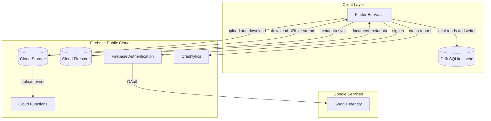
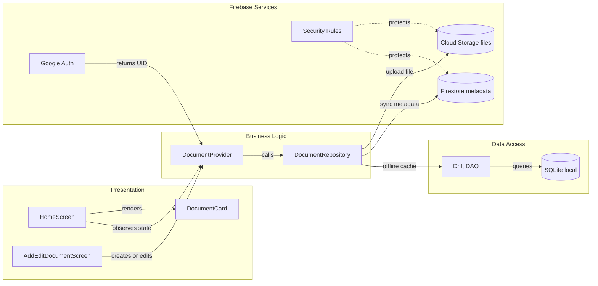

# EduVault - Firebase va kien truc Cloud

> Bo slide de trinh bay kien truc ung dung Quan ly tai lieu.  
> Pham vi phan tich duoc doi chieu voi ma nguon trong `eduvault`: Flutter, Provider,
> Drift SQLite, `file_picker` va `path_provider`.

---

## Slide 1 - Muc tieu

- Quan ly tai lieu hoc tap theo tieu de, mon hoc, danh muc, tag va muc uu tien.
- Ho tro dang nhap Google de xac dinh nguoi dung.
- Dong bo metadata va tep tai lieu tren nhieu thiet bi.
- Giu kha nang xem du lieu da tai ve khi mat mang.
- Giam phu thuoc vao bo nho cuc bo va cach sao luu thu cong.

---

## Slide 2 - Cac thanh phan cot loi hien tai

| Thanh phan | Hien trang trong EduVault | Vai tro |
|---|---|---|
| Frontend | Flutter Material 3, `HomeScreen`, `AddEditDocumentScreen`, widget tai lieu | Hien thi danh sach, tim kiem, loc, them, sua, xoa va mo tep |
| State va business logic | `Provider` + `ChangeNotifier` trong `DocumentProvider` | Quan ly trang thai, loc du lieu, lang nghe stream va goi repository |
| Backend | Chua co backend tap trung | Nghiep vu dang chay trong ung dung; chua co API, phan quyen server hay dong bo |
| Database | Drift ORM tren SQLite | Luu `DocumentsTable`, `CategoriesTable`, metadata, tag, ghi chu, ngay tao/cap nhat |
| File Storage | Tep duoc copy vao `ApplicationDocumentsDirectory/EduVault/Documents` | Luu tep tren thiet bi; database chi luu `filePathOrUrl` |
| External services | Chua co Firebase | Chua co Google Sign-In, Cloud Storage, Firestore hay backup tu dong |

**Ket luan:** day la mo hinh mobile don thiet bi, khong phai mo hinh Frontend -
Backend - Database - Storage day du. Firebase se bo sung cac lop con thieu.

---

## Slide 3 - Frontend va luong hien tai

```text
Nguoi dung
    |
    v
Flutter UI -> DocumentProvider -> DocumentRepository
                                      |
                                      v
                              Drift DAO / SQLite
                                      |
                                      v
                    Duong dan tep cuc bo tren thiet bi
```

- `Provider` duoc nap bang `MultiProvider` tai `main.dart`.
- Repository tach giao dien khoi Drift va cung cap `Stream<List<DocumentModel>>`.
- Tim kiem hien tai dung `LIKE` tren tieu de va mon hoc trong SQLite.
- Chuc nang chon tep dung `file_picker`, sau do copy tep vao thu muc rieng cua ung dung.
- Ung dung co the mo URL web, nhung URL do nguoi dung tu nhap khong phai kho tep tap trung.

---

## Slide 4 - Diem nghen khi chay tren ha tang truyen thong

1. **Du lieu bi khoa trong mot thiet bi:** mat may, go cai dat hoac doi may co the
   lam mat database va tep neu khong sao luu thu cong.
2. **Khong co dong bo va lam viec nhom:** cung mot tai lieu khong co phien ban
   tap trung, khong co conflict resolution va khong co chia se theo nguoi dung.
3. **File storage khong mo rong:** dung luong phu thuoc bo nho thiet bi; tep lon
   anh huong kha nang sao luu va toc do thao tac.
4. **Thieu Identity va Authorization:** bat ky ai co du lieu tren may co the
   truy cap; chua co ranh gioi tai lieu theo tai khoan.
5. **Khong co Backend de kiem soat nghiep vu:** khong co audit log, rate limit,
   validation tap trung, webhook hay tac vu xu ly nen.
6. **Kha nang phuc hoi thap:** khong co versioning, retention, replication va
   co che khoi phuc sau su co.
7. **Tim kiem chi trong pham vi local:** khong tim duoc tai lieu tren thiet bi
   khac va khong co full-text search tap trung.

---

## Slide 5 - Lua chon mo hinh Cloud

### Lua chon: Public Cloud, Firebase tren Google Cloud

| Phuong an | Danh gia |
|---|---|
| Public Cloud | Phu hop nhat cho nhom sinh vien: khong can tu van hanh server, co SDK Flutter, mo rong theo nhu cau |
| Private Cloud | Bao mat va kiem soat cao hon nhung chi phi van hanh, nhan su va ha tang khong can thiet cho pham vi hien tai |
| Hybrid Cloud | Co the la buoc tiep theo neu truong can luu du lieu nhay cam on-premise; hien tai lam tang do phuc tap |

### Dich vu de xuat

- **Firebase Authentication:** dang nhap Google, quan ly session va UID.
- **Cloud Firestore:** luu metadata tai lieu, danh muc, tag, owner, timestamp va
  quyen truy cap.
- **Cloud Storage for Firebase:** luu PDF, Word, PowerPoint, hinh anh va cac tep
  lon; Firestore luu `storagePath`, ten tep, kich thuoc va MIME type.
- **Firebase App Check:** giam truy cap tu ung dung gia mao.
- **Firebase Crashlytics:** theo doi crash tren client.
- **Cloud Functions for Firebase (tuy chon):** xu ly thumbnail, audit log,
  xoa tep mo coi va tac vu sau khi upload.

---

## Slide 6 - So sanh File Storage

| Dich vu | Uu diem | Han che | Ket luan |
|---|---|---|---|
| Firebase Cloud Storage | Tich hop Auth va Rules, SDK Flutter truc tiep, phu hop MVP | Can quan ly quota va chi phi doc/ghi | **Lua chon chinh** |
| AWS S3 | He sinh thai object storage lon, versioning va lifecycle manh | Can them Cognito/API hoac backend de phan quyen | Phu hop neu he thong da o AWS |
| Azure Blob Storage | Tier storage va Azure AD tot, phu hop enterprise Microsoft | Can thiet ke lop auth/API rieng cho Flutter | Phu hop khi he thong chuan Azure |
| Google Cloud Storage | Nen tang duoi Firebase, linh hoat khi can GCP | Quan ly truc tiep phuc tap hon Firebase SDK | Dung cho nhu cau GCP nang cao |

---

## Slide 7 - Kien truc dich vu dich

<!-- mermaid-checked: no \n, no em-dash/en-dash, no {} in labels, subgraphs are id["label"], arrows are -->|"label"|, all subgraphs closed by end, ids unique -->


---

## Slide 8 - Quan he thanh phan

<!-- mermaid-checked: no \n, no em-dash/en-dash, no {} in labels, subgraphs are id["label"], arrows are -->|"label"|, all subgraphs closed by end, ids unique -->


### Bang thanh phan

| Thanh phan | Lop | Trach nhiem sau tich hop |
|---|---|---|
| `HomeScreen` | Presentation | Hien thi tai lieu local va da dong bo |
| `AddEditDocumentScreen` | Presentation | Chon tep, validate form, tao metadata |
| `DocumentProvider` | Business | Dieu phoi auth state, cache, sync state va error state |
| `DocumentRepository` | Domain | Hop dong doc/ghi, khong de UI phu thuoc Firebase |
| Drift DAO | Data | Cache offline va truy van nhanh |
| Auth service | Infrastructure | Google sign-in, session, UID |
| Firestore service | Infrastructure | CRUD metadata va query theo `ownerId` |
| Storage service | Infrastructure | Upload/download tep theo duong dan co owner |
| Rules | Security | Chan truy cap chéo tai khoan va validate kich thuoc/MIME |

---

## Slide 9 - Luong dang nhap Google

1. Ung dung khoi tao `Firebase.initializeApp` theo cau hinh do `flutterfire configure`
   tao ra.
2. Nguoi dung bam **Dang nhap voi Google**.
3. `google_sign_in` mo OAuth consent; Google tra ve credential.
4. `FirebaseAuth.signInWithCredential` tao session Firebase va `uid`.
5. Ung dung tao hoac doc profile toi thieu trong `users/{uid}`.
6. Moi truy van Firestore va Storage deu bi Rules gioi han theo `request.auth.uid`.

Khong luu mat khau Google trong app. Khong dua API key, token dai han hoac service
account key vao repository.

---

## Slide 10 - Luong upload va dong bo tai lieu

### Upload

1. Chon tep va kiem tra extension, MIME type, kich thuoc.
2. Upload vao `users/{uid}/documents/{documentId}/file`.
3. Nhan ket qua upload, checksum, kich thuoc va `storagePath`.
4. Ghi document metadata vao `users/{uid}/documents/{documentId}`.
5. Cap nhat Drift cache, UI nhan thay doi qua stream.

### Download va offline

1. Doc danh sach tu Drift de hien thi ngay.
2. Khi co mang, dong bo metadata theo `updatedAt`.
3. Tep duoc tai theo nhu cau vao cache tep cuc bo.
4. Khi offline, cho phep doc metadata va tep da cache; danh dau thao tac dang cho
   dong bo thay vi bao thanh cong gia.

---

## Slide 11 - Quy trinh setup Firebase voi tai khoan nhom

> Chi dung tai khoan Google cua nhom co quyen Owner/Editor tren Firebase project.
> Khong ghi email, mat khau, refresh token hay service account key vao file nay.

### Chuan bi

```bash
firebase login
firebase projects:list
dart pub global activate flutterfire_cli
flutterfire configure
```

Trong `flutterfire configure`, chon Firebase project cua nhom va cac platform can
ho tro. Lenh nay tao `lib/firebase_options.dart`; file nay la cau hinh client,
khong thay the cho Security Rules.

### Them package Flutter

```bash
flutter pub add firebase_core firebase_auth google_sign_in
flutter pub add cloud_firestore firebase_storage
flutter pub add firebase_app_check
```

### Khoi tao Firebase

```dart
import 'package:firebase_core/firebase_core.dart';
import 'firebase_options.dart';

Future<void> main() async {
  WidgetsFlutterBinding.ensureInitialized();
  await Firebase.initializeApp(
    options: DefaultFirebaseOptions.currentPlatform,
  );
  runApp(const EduVaultApp());
}
```

### Bat tinh nang trong Firebase Console

- Authentication -> Sign-in method -> Google -> Enable.
- Firestore Database -> tao database, chon region gan nguoi dung.
- Storage -> tao bucket, dat Rules truoc khi cho phep upload.
- App Check -> bat sau khi test xong debug provider.
- Crashlytics -> bat cho build release.

Tai lieu tham khao chinh: [Firebase setup cho Flutter](https://firebase.google.com/docs/flutter/setup?hl=vi).

---

## Slide 12 - Security Rules de xuat

Mo hinh duong dan:

```text
users/{uid}/documents/{documentId}
users/{uid}/documents/{documentId}/file
```

Nguyen tac:

- `read` va `write` chi khi `request.auth.uid == uid`.
- Chi cho phep create metadata neu `ownerId == request.auth.uid`.
- Gioi han `contentType` theo danh sach PDF, Office, anh va text.
- Gioi han kich thuoc tep truoc khi ghi.
- Khong dung `allow read, write: if true` trong production.
- Khong cap phat public download URL lau dai; uu tien Firebase SDK va Rules.
- Bat audit log cho thao tac xoa/sua quan trong neu yeu cau nghiep vu.

---

## Slide 13 - Tac dong bao mat, chi phi va hieu suat

| Tieu chi | Tac dong tich cuc | Rui ro / chi phi can quan ly | Giam thieu |
|---|---|---|---|
| Bao mat | Google Auth, UID, Rules, TLS, App Check | Rules sai co the lo du lieu; mat tai khoan nhom anh huong project | Least privilege, MFA, review Rules, tach dev/prod |
| Chi phi | Khong mua server, tra theo muc su dung, co free quota | Doc/ghi Firestore, egress va dung luong Storage tang theo so file | Query theo owner, pagination, cache, lifecycle, quota alert |
| Hieu suat | CDN/object storage va SDK toi uu cho tep lon; Firestore scale tu dong | Upload lan dau phu thuoc mang; query thiet ke kem co the ton doc | Upload resumable, nen tep, index, lazy download, offline cache |
| Van hanh | Crashlytics va backup/versioning ho tro quan tri | Phu thuoc nha cung cap, co the bi lock-in Firebase | Export du lieu dinh ky, abstraction repository, quy trinh restore |

---

## Slide 14 - Ke hoach chuyen doi theo giai doan

1. **Nen tang:** tao Firebase project dev, chay `flutterfire configure`, bat Auth
   va viet Rules toi thieu.
2. **Auth:** them Google Sign-In, trang thai loading/error/logout va map UID.
3. **Metadata:** giu Drift lam cache, them adapter Firestore trong repository.
4. **File:** upload Cloud Storage, luu `storagePath` thay cho duong dan may.
5. **Sync:** them hang doi offline, retry co backoff, conflict policy theo
   `updatedAt` va trang thai dong bo.
6. **Production:** tach project dev/prod, Crashlytics, quota alert, backup va
   kiem thu Rules bang Emulator Suite.

---

## Slide 15 - Ket luan

- Kien truc hien tai don gian va tot cho offline, nhung gioi han o backup,
  dong bo, multi-user va kha nang mo rong.
- Public Cloud voi Firebase la lua chon phu hop nhat cho nhom: Auth + Firestore +
  Cloud Storage cung cap du cac khoi can thiet voi thoi gian van hanh thap.
- Drift nen duoc giu lam local cache; Firebase la nguon dong bo tap trung sau khi
  auth va Rules da duoc thiet ke dung.
- Khong duoc xem viec them Firebase package la hoan tat tich hop: can ca
  Security Rules, quota, retry, backup, test offline va quy trinh tach moi truong.

